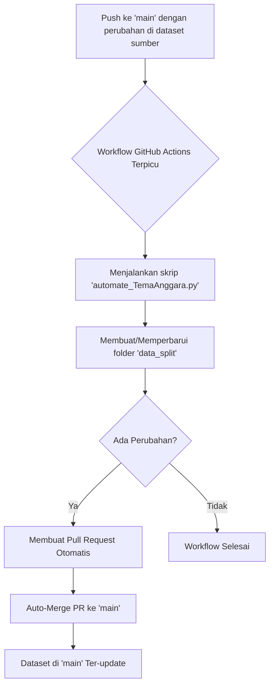

# Eksperimen SML: Otomatisasi Preprocessing Dataset Beras

Proyek ini merupakan implementasi dari pipeline MLOps sederhana yang berfokus pada otomatisasi pemrosesan awal (preprocessing) dataset. Alur kerja (workflow) utama dalam repositori ini secara otomatis membagi dataset gambar beras menjadi set data latih, validasi, dan uji setiap kali ada pembaruan pada dataset sumber.

Tujuan proyek ini adalah untuk menunjukkan bagaimana GitHub Actions dapat dimanfaatkan untuk menciptakan pipeline data yang andal, konsisten, dan tidak memerlukan intervensi manual.

## Tentang Dataset: Rice Image Dataset

Proyek ini menggunakan dataset gambar beras yang tersedia untuk publik, yang berisi gambar dari lima varietas beras yang berbeda.

- **Sumber Dataset:** [Rice Image Dataset di Kaggle](https://www.kaggle.com/datasets/muratkokludataset/rice-image-dataset)
- **Website Alternatif:** [Murat KOKLU Datasets](https://www.muratkoklu.com/datasets/)

### Sorotan Dataset

- Dataset ini terdiri dari lima varietas beras: **Arborio, Basmati, Ipsala, Jasmine, dan Karacadag**.
- Total terdapat **75.000 gambar**, dengan masing-masing varietas menyumbang 15.000 gambar.
- Penelitian asli yang menggunakan dataset ini berhasil mencapai **tingkat akurasi klasifikasi 100%** dengan menggunakan model Convolutional Neural Network (CNN).

### Sitasi dan Referensi

Jika Anda menggunakan dataset ini untuk penelitian, harap mengutip karya-karya berikut yang menjadi dasar dari dataset ini:

> - Koklu, M., Cinar, I., & Taspinar, Y. S. (2021). Classification of rice varieties with deep learning methods. _Computers and Electronics in Agriculture, 187_, 106285. [https://doi.org/10.1016/j.compag.2021.106285](https://doi.org/10.1016/j.compag.2021.106285)
>
> - Cinar, I., & Koklu, M. (2021). Determination of Effective and Specific Physical Features of Rice Varieties by Computer Vision In Exterior Quality Inspection. _Selcuk Journal of Agriculture and Food Sciences, 35(3)_, 229-243. [https://doi.org/10.15316/SJAFS.2021.252](https://doi.org/10.15316/SJAFS.2021.252)
>
> - Cinar, I., & Koklu, M. (2022). Identification of Rice Varieties Using Machine Learning Algorithms. _Journal of Agricultural Sciences_. [https://doi.org/10.15832/ankutbd.862482](https://doi.org/10.15832/ankutbd.862482)
>
> - Cinar, I., & Koklu, M. (2019). Classification of Rice Varieties Using Artificial Intelligence Methods. _International Journal of Intelligent Systems and Applications in Engineering, 7(3)_, 188-194. [https://doi.org/10.18201/ijisae.2019355381](https://doi.org/10.18201/ijisae.2019355381)

## Struktur Proyek

```
Eksperimen_SML_Nama-siswa/
├── .github/
│   └── workflows/
│       └── preprocess_dataset.yml    # File workflow GitHub Actions
├── Rice_Image_Dataset/               # Folder dataset sumber (mentah)
│   ├── Arborio/
│   ├── Basmati/
│   ├── ... (dan kelas lainnya)
├── preprocessing/
│   ├── automate_TemaAnggara.py       # Skrip Python untuk otomasi
│   └── data_split/                   # Folder hasil preprocessing (dibuat otomatis)
│       ├── train/
│       ├── val/
│       └── test/
└── README.md                         # File ini
```

## Alur Kerja Otomatis (GitHub Actions)

Repositori ini dilengkapi dengan pipeline CI (Continuous Integration) yang sepenuhnya otomatis menggunakan GitHub Actions. Pipeline ini bertanggung jawab untuk menjaga agar dataset yang diproses (`data_split/`) selalu sinkron dengan dataset sumber (`Rice_Image_Dataset/`).

Berikut adalah cara kerjanya:

1.  **Pemicu (Trigger):** Alur kerja akan berjalan secara otomatis setiap kali ada `push` ke branch `main` yang melibatkan perubahan pada folder `Rice_Image_Dataset/` atau pada skrip `preprocessing/automate_TemaAnggara.py`.
2.  **Setup Lingkungan:** Sebuah runner virtual di GitHub disiapkan dengan lingkungan Python versi 3.9.
3.  **Eksekusi Skrip:** Skrip `preprocessing/automate_TemaAnggara.py` dijalankan. Skrip ini akan membaca semua gambar dari `Rice_Image_Dataset/`, mengacaknya, dan membaginya ke dalam folder `preprocessing/data_split/` dengan rasio **70% train, 15% validation, dan 15% test**.
4.  **Pembuatan Pull Request:** Jika skrip menghasilkan perubahan pada isi folder `data_split/`, sebuah Action khusus akan secara otomatis membuat branch baru dan membuka Pull Request (PR) ke branch `main`.
5.  **Auto-Merge:** PR yang baru dibuat tersebut kemudian akan **langsung digabungkan (merge) secara otomatis**.
6.  **Hasil:** Folder `data_split/` di branch `main` akan selalu berisi versi terbaru dari dataset yang telah diproses, tanpa memerlukan intervensi manual sama sekali.

### Diagram Alur Kerja



## Cara Menjalankan Secara Lokal

Jika Anda ingin menjalankan proses pemisahan data secara manual di komputer lokal Anda:

1.  Pastikan Anda memiliki Python 3.9 atau lebih tinggi.
2.  Install dependensi yang dibutuhkan:
    ```bash
    pip install tqdm
    ```
3.  Jalankan skrip dari direktori root proyek:
    ```bash
    python preprocessing/automate_TemaAnggara.py
    ```
    Skrip akan secara otomatis menemukan `Rice_Image_Dataset/` dan membuat hasilnya di `preprocessing/data_split/`.

---

_Proyek ini dibuat oleh: Tema Anggara_
